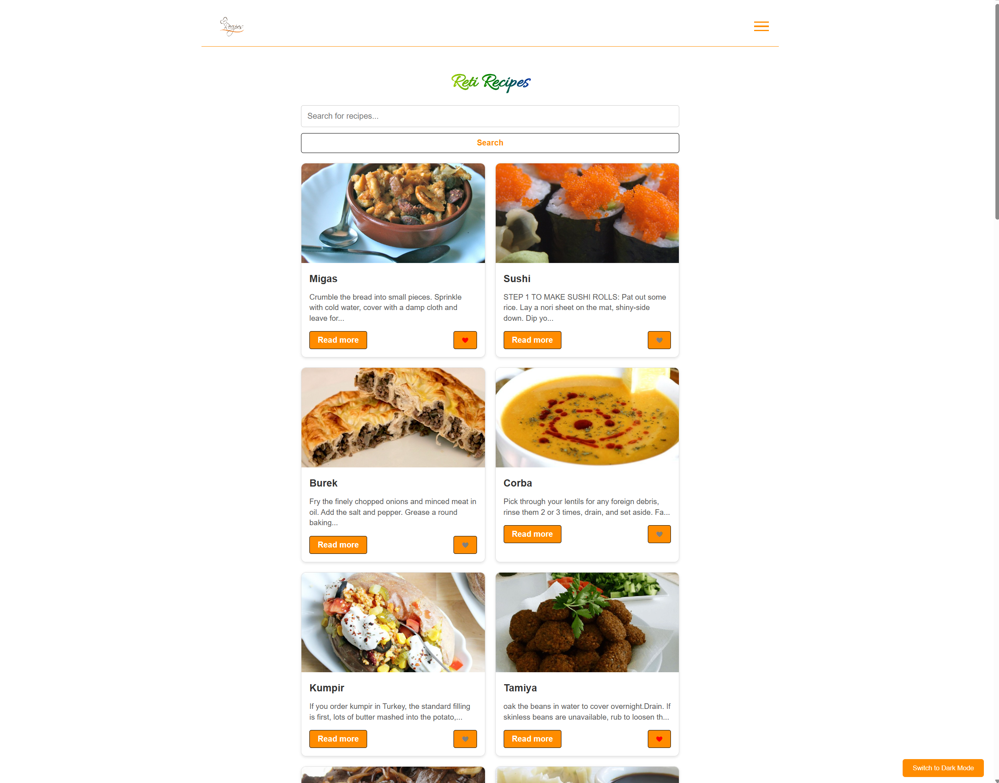
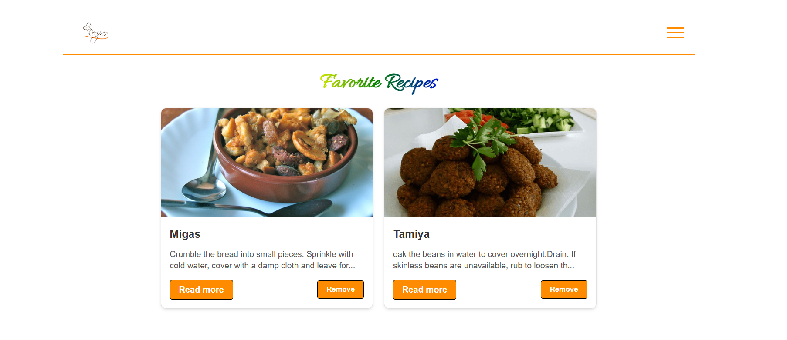
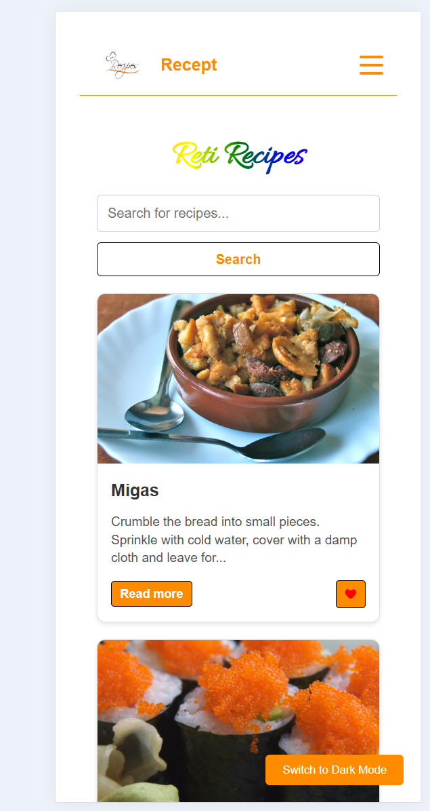

# Reti Recipes

Reti Recipes is a modern recipe application built with **Vue.js** and **TypeScript**.  
It fetches recipes from an API, displays them in a clean interface, and allows users to save their favorite recipes locally.  

---

##  Features

- **Fetch Recipes from API**: Uses [TheMealDB API](https://www.themealdb.com/) to search and display recipes.  
- **Favorites Management**: Add or remove recipes from favorites, stored locally in the browser.  
- **Responsive Design**: Works seamlessly on mobile, tablet, and desktop.  
- **Search Functionality**: Search for recipes by keyword.  
- **Navigation**: Includes multiple pages (`Home`, `Favorites`, `Login`, `Sign Up`) using Vue Router.  
- **Recipe Details**: View recipe details on dynamic routes (`/recipe/:id`).  
- **Protected Routes**: Favorites page is only accessible when logged in.  
- **Custom 404 Page**: Handles invalid routes gracefully.  

---

##  Screenshots

> Place your screenshots in `/src/assets/screenshots/` and update the filenames.

### Home Page  

### Favorites Page  

### Mobile View  

---

## Getting Started

### Prerequisites

Make sure you have installed:  
- [Node.js](https://nodejs.org/) (>=16)  
- [npm](https://www.npmjs.com/) or [yarn](https://yarnpkg.com/)  

### Installation

# Clone the repository
git clone <repository-url>

# Navigate to project folder
cd <project-folder>

# Install dependencies
npm install

# Start the application
npm run dev

## Project Structure
|-- server              # Backend server
├── src
│   ├── assets          # Images and global resources
│   │   └── screenshots # Screenshots for README
│   ├── components      # Vue components
│   ├── composables     # Reusable logic (custom hooks)
│   ├── router          # Vue Router configuration
│   ├── types           # TypeScript type definitions
│   ├── views           # Page components
│   └── App.vue         # Root component
├── public              # Static files
└── README.md           # Project documentation

## Backend Server
The backend is built with Express and provides:

Recipe fetching from TheMealDB API

Favorite management (add, remove, fetch)

Automatic port handling if the default port is taken
The server starts automatically when running:
### npm run dev

## Tech Stack
Vue.js – Frontend framework

TypeScript – Strongly typed JavaScript

Vue Router – Page routing & navigation

Axios – API requests

Express – Lightweight backend server

Concurrently – Run client & server together

Local Storage – Store favorites in the browser

## How to Contribute
1. Fork the repo & clone it locally.
2. Create a new branch for your feature:
### git checkout -b feature/new-awesome-feature
3. Commit your changes and push to your fork.
4. Create a pull request

## Ideas for Future Improvements
. Improve API error handling

. Add global state management (e.g., Pinia or Vuex)

. Write unit tests for components and composables

. Polish UI/UX for a smoother experience

## Author
Developed by Zabi.
This project was created as part of a course and serves as a foundation for learning Vue.js and TypeScript.

